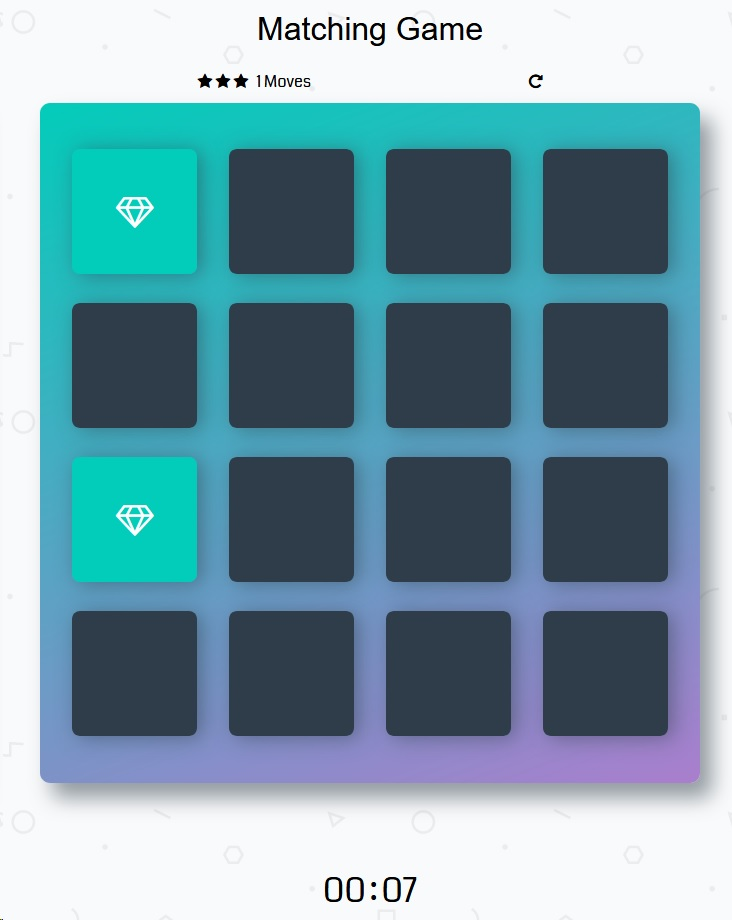

# memory-game
In memory game you click on cards to open them. If they match, they changes colour to green. If they do not match they stay black.
Above the deck you can see how many moves you have made so far. Every 10, 20, 30 move it removes you one star.
Once you find all cards which mathces, then alert message shows up telling you how many steps you made, how many stars and what time it took you.
Below the deck there is a timer to measure how long it takes you to find all matched cards.

