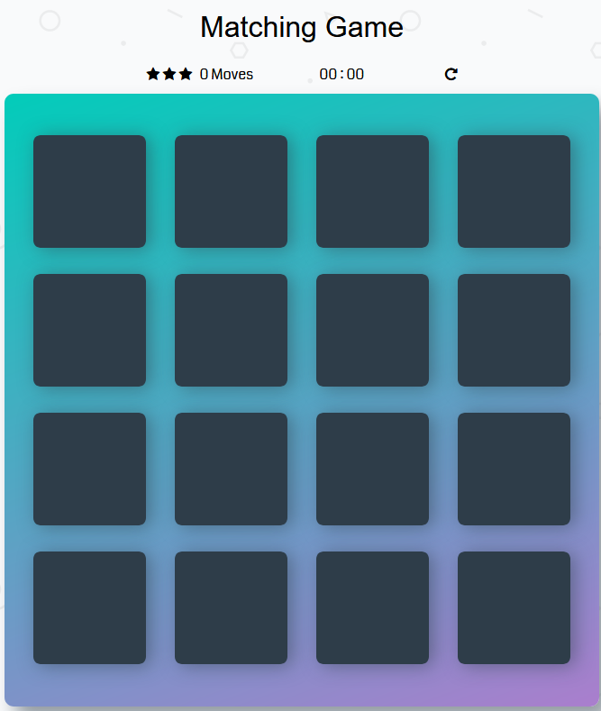
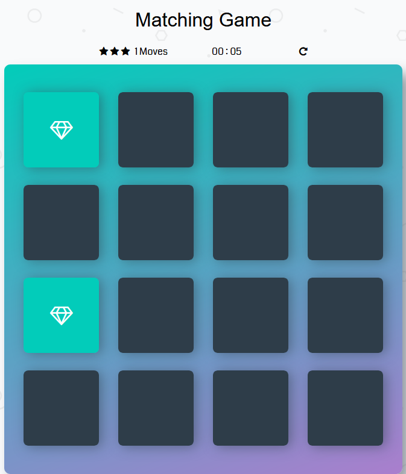
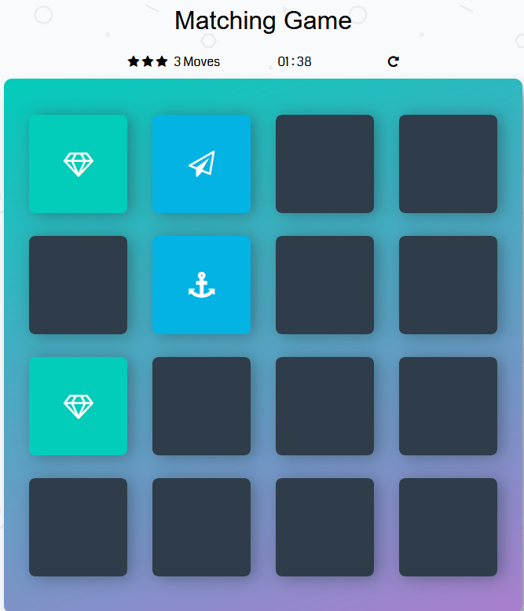
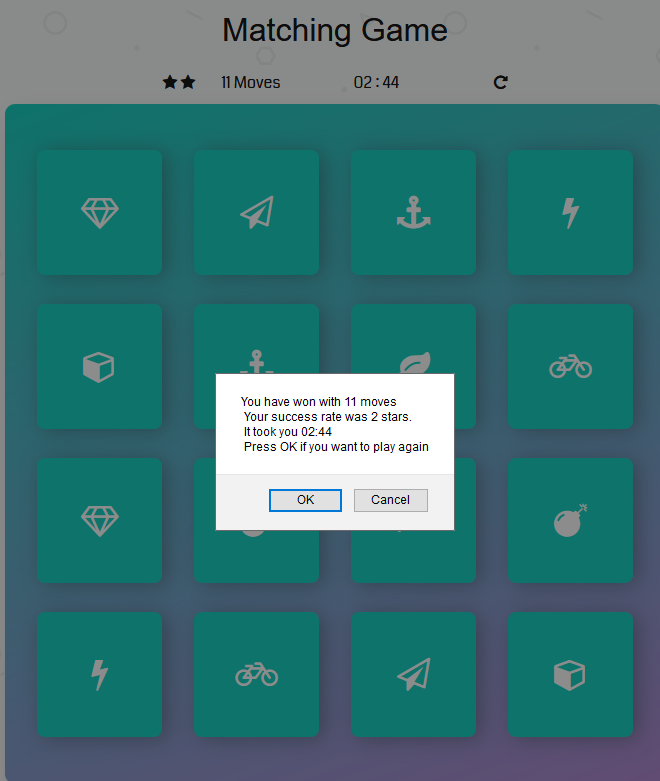

# memory-game
In memory game you click on cards to open them. If they match, they changes colour to green. If they do not match they stay black.
Above the deck you can see how many moves you have made so far. Every 10, 20, 30 move it removes you one star.
Once you find all cards which mathes, then alert message shows up telling you how many steps you made, how many stars and what time it took you.
Below the deck there is a timer to measure how long it takes you to find all matched cards.

## How to open the game
When you clone the files from github repository, just click on html file to open the game.

## List of dependencies
The game uses Coda fonts from this web page https://fonts.googleapis.com/css?family=Coda"
It also needs access to css file which from this web page https://maxcdn.bootstrapcdn.com/font-awesome/4.6.1/css/font-awesome.min.css

## How to play the Game
Click on any black card. After the card is clicked it shows the symbol and change color to blue. Then you will click second card to find a match with firt one.
If first two cards match they change color to green like in below picture

If two cards do not match, they will change color to black and hide symbol like in below pic

When you find all matched cards which is 8 pairs then another alert window pop up and shows you how long it took you to finish game, how many moves you did and what stars score you got.

